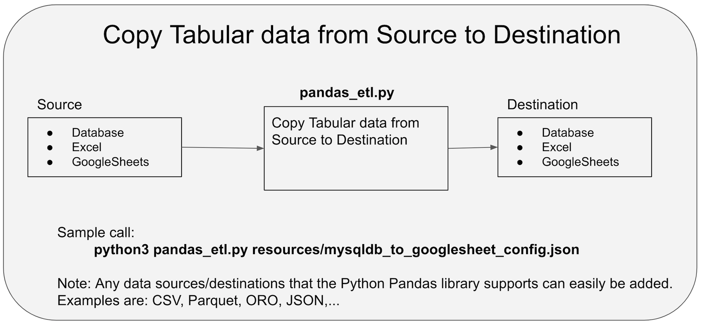

# Repo Overview
This repo contains Python experiments.

Descriptions of the various directories
* **basics** - Simple experiments with the basics of python like lists, for loops, functions and methods
* **pandas** - Experiments with Pandas as well as experiments with copying data from databases, GoogleSheets, Excel files 
and data to the same. This ability to copy source tabular data to a destination data store is implemented in 'pandas_etl.py'. 
 The implementation looks as follows: datasource -> Pandas DataFrame -> destination. This capability warrants further explanation. 

# pandas_etl.py

The following diagram depicts how 'pandas_etl.py' works: 

## Further explanation of pandas_etl.py:

As an example a GoogleSheet API could be called to get 
spreadsheet data and this data would be converted to a Pandas DataFrame and the DataFrame could be saved 
 to a database table.  Currently, database (sql), Excel, and GoogleSheets are allowed
as both sources and destinations. The Panda's library is used to implement pandas_etl.py and so any
data format that Pandas supports could also easily be added (Parquet, ORO, CSV, JSON,..). See the following for the possible pandas datasources and
datasinks: https://pandas.pydata.org/pandas-docs/stable/reference/io.html

pandas_etl.py takes a config file (json) as an argument. This file has configuration information for both the
source and destination.  The following directory has examples for all supported sources and destinations: https://github.com/stevensouza/playground_python/tree/master/pandas/resources.  

## Examples:

A few examples follow.  The examples can be invoked from within the 'pandas' directory. 
(Note: In the cases of mysql and GoogleSheets examples you would need to change them to use your respective credentials):
* Copy an in memory data structure to a sql lite internal database.  This example can be run as is so is a good starting point:
  * **python3 pandas_etl.py resources/memory_to_sqllitedb_config.json**
* Copy an Excel table to a sqllite database (works as is)
  *  **python3 pandas_etl.py resources/excel_to_sqllitedb_config.json**
* Copy a mysql table to GoogleSheets (change credentials)
  * **python3 pandas_etl.py resources/mysqldb_to_googlesheet_config.json**
* Copy a dummy memory table to GoogleSheets (change credentials)
  * **python3 pandas_etl.py resources/memory_to_googlesheet_config.json**
* Copy a large googlesheet to a sql lite table (change credentials). The sheet had about 
  110,000 rows and 10 columns (8 columns contained short strings, one column contained 
  an integer and one column contained a date). It took about 80 seconds to run.
    * **python3 pandas_etl.py resources/biggooglesheet_to_sqllitedb_config.json**

## Prerequisites:

To run these programs I used python3 v 3.7.3 on a macbook pro. 
The following need to be installed for 'pandas_etl.py' to run (doing this by memory so there may be more, but I think that is it.)
* GoogleSheets. The code uses a google service account to grab spreadsheet data rows and convert them to a Pandas DataFrame - pip3  install --upgrade google-api-python-client google-auth-httplib2 google-auth-oauthlib
* Pandas - pip3 install pandas --user
* DBAccess/Used with Pandas - pip3 install sqlalchemy --user
* DBAccess/Used with Pandas/Connect to MySql - pip3 install pymysql --user

## Notes:
* All source types assume the first row is a header (i.e. GoogleSheets, Excel). However this could be easily fixed if needed

Note from SqlAlchemy site, and the reason I used 'PyMySQL': 

> "The MySQL Connector/Python DBAPI has had many issues since its release, some of  which may remain unresolved, and 
the mysqlconnector dialect is not tested as part of SQLAlchemy’s continuous integration. The recommended MySQL 
dialects are mysqlclient and PyMySQL."